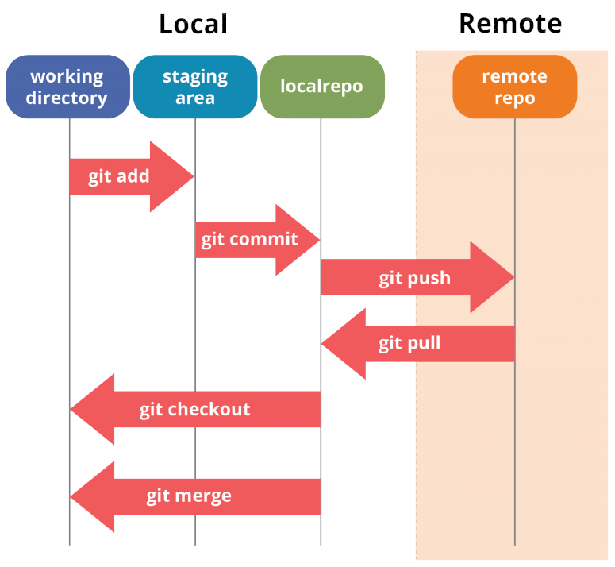
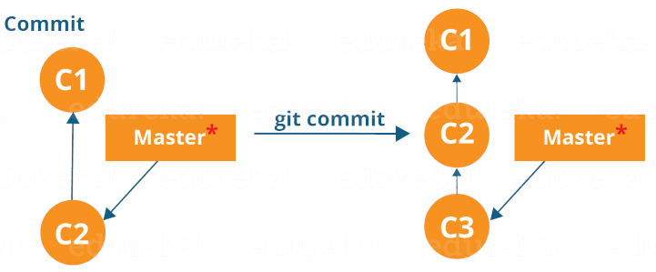
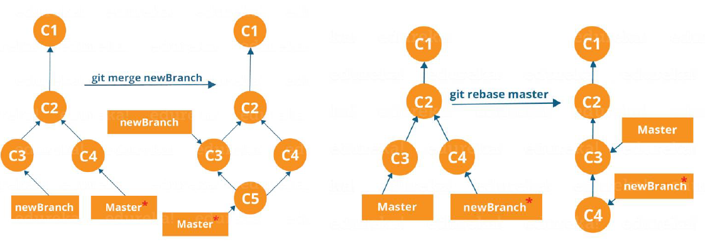
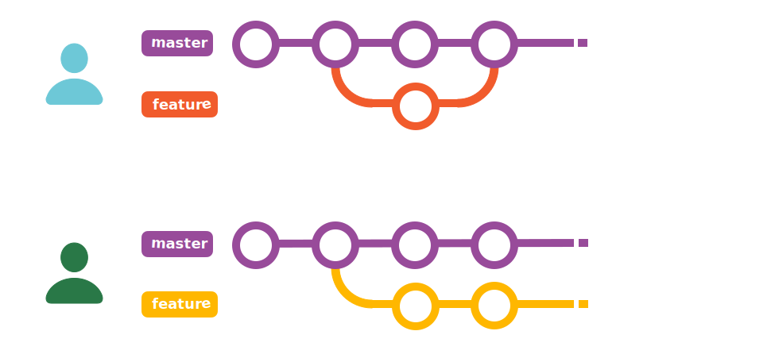

# Git e GitHub  

---

## Índice
- Introdución  
- Git  
- Funcionamento de Git  
- Comandos básicos de Git  
- DevSecOps  

---

## Introdución

Un **sistema de control de versións (VCS)** é un software que nos permite xestionar un rexistro de cambios que realizamos a un conxunto de ficheiros ao longo do tempo.  
Fai posible recuperar versións específicas e é especialmente útil en proxectos nos que traballan varias persoas de forma simultánea.  

Outros nomes:  
- Xestión do código fonte (SCM)  
- Sistema de control de revisións  

---

## Características

- Permiten reverter cambios a unha versión anterior.  
- Permiten resolver conflitos se varias persoas traballan sobre un ficheiro ao mesmo tempo.  
- Funcionamento distribuido: permiten copias de seguridade remotas.  
- Desenvolvemento non lineal mediante **ramas (branches)**.

---

## Ferramentas

- **Git** → [https://git-scm.com/](https://git-scm.com/)  
- **CVS** → [https://www.nongnu.org/cvs/](https://www.nongnu.org/cvs/)  
- **Apache Subversion (SVN)** → [https://subversion.apache.org/](https://subversion.apache.org/)  
- **Mercurial** → [https://www.mercurial-scm.org/](https://www.mercurial-scm.org/)  
- **Monotone** → [https://www.monotone.ca/](https://www.monotone.ca/)  
- **Bazaar** → [https://bazaar.canonical.com/en](https://bazaar.canonical.com/en)  

---
| **Característica** | **SVN** | **Git** |
|---------------------|----------|---------|
| **Repositorio** | Centralizado | Distribuido |
| **Conectividade** | Require conexión ao servidor para a maioría de operacións. | Permite traballar offline e sincronizar despois. |
| **Velocidade** | Lento debido á dependencia do servidor. | Rápido grazas a ser distribuido. |
| **Ramas** | Costosas e lentas de crear e fusionar | Lixeiras e rápidas |
| **Fusión** | Complicada e propensa a conflitos | Optimizado, mellor manexo de fusións automáticas |
| **Historial** | Centralizado, lineal e fácil de modificar. | Distribuido e máis difícil de modificar. |
| **Seguridade** | Baseada en permisos no servidor | Baseado en criptografía con SHA-1 e verificacións de integridade. |

---
## Git

Empregaremos **Git** por ser un dos máis eficientes e estendidos.

### Conceptos básicos

- **Repositorio:** contedor onde Git garda o historial de cambios.  
- **Commit:** punto do historial que representa un cambio gardado.  
- **Rama (branch):** liña de desenvolvemento diferente.  
- **Merge:** fusión entre ramas.  
- **Staging area:** zona onde se preparan os arquivos antes de confirmalos.  

---

## Funcionamento

Git emprega repositorios **locais** e **remotos**.  
Dentro do equipo local traballamos nun **working directory**.  
Non todos os ficheiros do directorio son xestionados por Git, só aqueles incluídos no **staging area**.



As versións dos ficheiros vanse gardando no repositorio local e, se se desexa, transmítense ao remoto.

Un **commit** é unha imaxe dos cambios feitos ata certo momento. Estas imaxes non se modificarán a non ser que se faga explícitamente.


As distintas ramas poden:  
- **Mezclarse (merge)**  
- **Situarse unha detrás doutra (rebase)**



---

## Comandos básicos

### Configuración

Configura os datos básicos de Git antes de comezar a traballar.

- **Definir o nome de usuario global:**
  ```bash
  git config --global user.name "usuario"
  ```

- **Definir o editor por defecto (por exemplo, Emacs, Vim, Nano...):**
  ```bash
  git config --global core.editor emacs
  ```

- **Configurar o comportamento dos fins de liña (LF/CRLF):**
  ```bash
  git config --global core.autocrlf input|true
  ```

💡 *Ao traballar con Docker é recomendable empregar a opción de Linux:* `input`.

---

### Creación e clonación

- **Crear un novo repositorio local:**
  ```bash
  git init
  ```

- **Clonar un repositorio remoto existente:**
  ```bash
  git clone https://url/repositorio.git
  ```

---

### Seguimento de cambios

- **Ver o estado actual do repositorio (arquivos modificados, engadidos, etc.):**
  ```bash
  git status
  ```

- **Engadir un ficheiro específico ao “staging area”:**
  ```bash
  git add arquivo.txt
  ```

- **Engadir todos os cambios do directorio actual:**
  ```bash
  git add .
  ```

- **Eliminar un ficheiro do “staging area” (sen borrar o ficheiro):**
  ```bash
  git restore --staged arquivo.txt
  ```

---

### Confirmación de cambios

- **Crear un novo commit cos cambios preparados:**
  ```bash
  git commit -m "Mensaxe clara"
  ```

- **Modificar o último commit (por exemplo, para corrixir a mensaxe):**
  ```bash
  git commit --amend
  ```

---

### Traballar con ramas

- **Crear unha nova rama:**
  ```bash
  git branch nova-rama
  ```

- **Cambiar a unha rama existente:**
  ```bash
  git checkout nova-rama
  ```

- **Listar todas as ramas dispoñibles:**
  ```bash
  git branch
  ```

- **Fusionar outra rama coa actual:**
  ```bash
  git merge nome-rama
  ```

- **Eliminar unha rama:**
  ```bash
  git branch -d nome-rama
  ```

---

### Sincronización con repositorio remoto

- **Engadir un repositorio remoto:**
  ```bash
  git remote add origin https://github.com/usuario/repositorio.git
  ```

- **Subir cambios locais ao remoto:**
  ```bash
  git push origin nome-rama
  ```

- **Obter e integrar cambios do remoto:**
  ```bash
  git pull origin nome-rama
  ```

---

### Desfacer cambios

- **Reverter un ficheiro ao último commit:**
  ```bash
  git checkout -- arquivo.txt
  ```

- **Outra opción moderna para restaurar un ficheiro:**
  ```bash
  git restore arquivo.txt
  ```

- **Descartar todos os cambios locais e volver ao último commit:**
  ```bash
  git reset --hard HEAD
  ```

- **Actualizar o proxecto local cos cambios remotos:**
  ```bash
  git pull origin nome-rama
  ```

---

### Outros comandos útiles

- **Ver o historial de commits:**
  ```bash
  git log
  ```

- **Amosar as diferenzas entre arquivos modificados:**
  ```bash
  git diff
  ```

- **Gardar temporalmente cambios sen facer commit (stash):**
  ```bash
  git stash
  ```

- **Crear etiquetas (tags) para versións específicas:**
  ```bash
  git tag
  ```

---

## GitHub

**GitHub** é unha plataforma que permite almacenar, compartir e colaborar na realización de código.

### Funcionalidades principais

- Presentar ou compartir traballo.  
- Seguir e administrar cambios no código ao longo do tempo.  
- Deixar que outros usuarios revisen o código e realicen suxestións para melloralo.  
- Colaborar sen preocuparse de que os cambios afecten a outros colaboradores.

---

### Crear unha conta

1. Ir a [https://github.com](https://github.com)  
2. Facer clic en *Registrarse*  
3. Seguir as instrucións

---

### Uso de SSH recomendado

Guía: [Engadir unha nova clave SSH a GitHub](https://docs.github.com/es/authentication/connecting-to-github-with-ssh/adding-a-new-ssh-key-to-your-github-account)

Para crear unha clave SSH no equipo local:

```bash
ssh-keygen
```

Isto xerará dúas claves (pública e privada) no directorio `~/.ssh`.  
A clave pública súbese a GitHub.

---

## Fluxos de traballo

### 1. Só con rama principal (main/master)

Recomendado para proxectos e equipos pequenos.

---

### 2. Baseado en funcionalidades

- A rama `main` ten sempre a versión estable.  
- As novas funcionalidades desenvólvense en ramas separadas (*features*).  
- Ao rematar, faise un **merge** cara á rama principal.

---

### 3. Gitflow

Recomendado para proxectos e equipos grandes.  
A rama `master/main` emprégase só para **releases**.

---

### 4. Forking workflow

- Cada desenvolvedor fai un **fork** (copia do repositorio).  
- Cada un traballa na súa propia copia.  
- Cando remata o seu traballo, realiza un **pull request**.  
- As modificacións son revisadas e aprobadas antes de incorporarse.

---

## Referencias

- [Documentación oficial de Git](https://git-scm.com/doc)  
- [Documentación de GitHub](https://docs.github.com/es)  
- [Gitflow – Aula Software Libre](https://aulasoftwarelibre.github.io/taller-de-git/gitflow/#-git-flow-hotfix)
