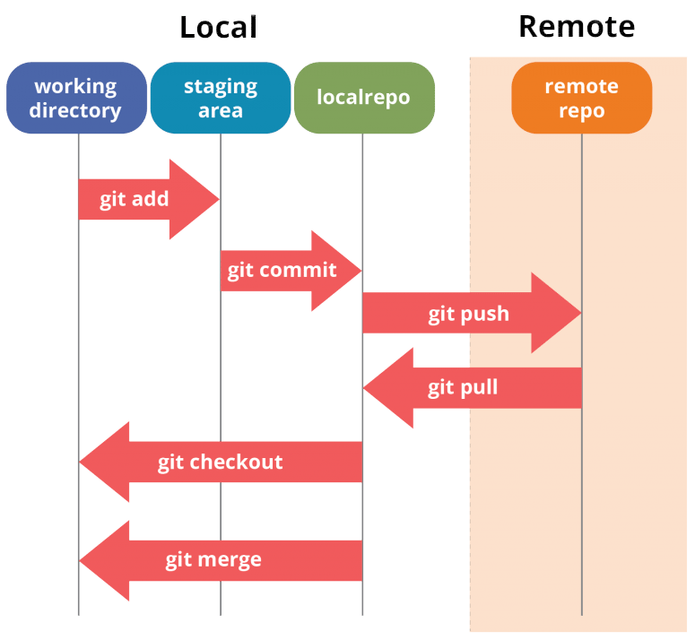
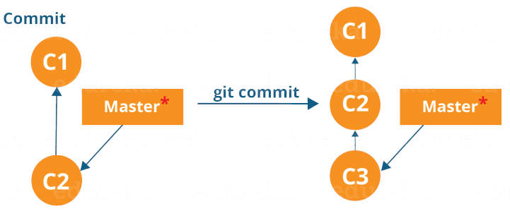
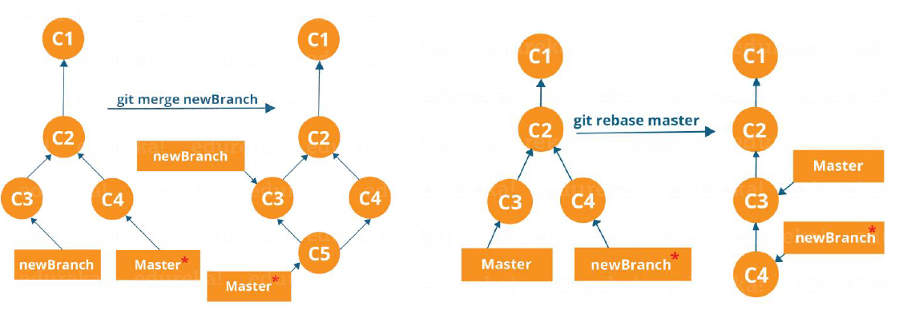

# Git y GitHub  

---

## Índice
- Introducción  
- Git  
- Funcionamiento de Git  
- Comandos básicos de Git  
- DevSecOps  

---

## Introducción

Un **sistema de control de versiones (VCS)** es un software que nos permite gestionar un registro de cambios realizados a un conjunto de archivos a lo largo del tiempo.  
Hace posible recuperar versiones específicas y es especialmente útil en proyectos donde trabajan varias personas de forma simultánea.  

Otros nombres:  
- Gestión del código fuente (SCM)  
- Sistema de control de revisiones  

---

## Características

- Permiten revertir cambios a una versión anterior.  
- Permiten resolver conflictos si varias personas trabajan sobre un mismo archivo al mismo tiempo.  
- Funcionamiento distribuido: permiten copias de seguridad remotas.  
- Desarrollo no lineal mediante **ramas (branches)**.

---

## Herramientas

- **Git** → [https://git-scm.com/](https://git-scm.com/)  
- **CVS** → [https://www.nongnu.org/cvs/](https://www.nongnu.org/cvs/)  
- **Apache Subversion (SVN)** → [https://subversion.apache.org/](https://subversion.apache.org/)  
- **Mercurial** → [https://www.mercurial-scm.org/](https://www.mercurial-scm.org/)  
- **Monotone** → [https://www.monotone.ca/](https://www.monotone.ca/)  
- **Bazaar** → [https://bazaar.canonical.com/en](https://bazaar.canonical.com/en)  

---
| **Característica** | **SVN** | **Git** |
|---------------------|----------|---------|
| **Repositorio** | Centralizado | Distribuido |
| **Conectividad** | Requiere conexión al servidor para la mayoría de operaciones. | Permite trabajar offline y sincronizar después. |
| **Velocidad** | Lento debido a la dependencia del servidor. | Rápido gracias a ser distribuido. |
| **Ramas** | Costosas y lentas de crear y fusionar | Ligeras y rápidas |
| **Fusión** | Complicada y propensa a conflictos | Optimizada, mejor manejo de fusiones automáticas |
| **Historial** | Centralizado, lineal y fácil de modificar. | Distribuido y más difícil de modificar. |
| **Seguridad** | Basada en permisos en el servidor | Basado en criptografía con SHA-1 y verificaciones de integridad. |

---
## Git

Usaremos **Git** por ser uno de los más eficientes y extendidos.

### Conceptos básicos

- **Repositorio:** contenedor donde Git guarda el historial de cambios.  
- **Commit:** punto del historial que representa un cambio guardado.  
- **Rama (branch):** línea de desarrollo diferente.  
- **Merge:** fusión entre ramas.  
- **Staging area:** zona donde se preparan los archivos antes de confirmarlos.  

---

## Funcionamiento

Git utiliza repositorios **locales** y **remotos**.  
Dentro del equipo local trabajamos en un **working directory**.  
No todos los archivos del directorio son gestionados por Git, solo aquellos incluidos en el **staging area**.



Las versiones de los archivos se van guardando en el repositorio local y, si se desea, se transmiten al remoto.

Un **commit** es una imagen de los cambios hechos hasta cierto momento. Estas imágenes no se modificarán a menos que se haga explícitamente.


Las distintas ramas pueden:  
- **Mezclarse (merge)**  
- **Situarse una detrás de otra (rebase)**



---

## Comandos básicos

### Configuración

Configura los datos básicos de Git antes de comenzar a trabajar.

- **Definir el nombre de usuario global:**
  ```bash
  git config --global user.name "usuario"
  ```

- **Definir el editor por defecto (por ejemplo, Emacs, Vim, Nano...):**
  ```bash
  git config --global core.editor emacs
  ```

- **Configurar el comportamiento de los fines de línea (LF/CRLF):**
  ```bash
  git config --global core.autocrlf input|true
  ```

💡 *Al trabajar con Docker es recomendable usar la opción de Linux:* `input`.

---

### Creación y clonación

- **Crear un nuevo repositorio local:**
  ```bash
  git init
  ```

- **Clonar un repositorio remoto existente:**
  ```bash
  git clone https://url/repositorio.git
  ```

---

### Seguimiento de cambios

- **Ver el estado actual del repositorio (archivos modificados, añadidos, etc.):**
  ```bash
  git status
  ```

- **Añadir un archivo específico al “staging area”:**
  ```bash
  git add archivo.txt
  ```

- **Añadir todos los cambios del directorio actual:**
  ```bash
  git add .
  ```

- **Eliminar un archivo del “staging area” (sin borrar el archivo):**
  ```bash
  git restore --staged archivo.txt
  ```

---

### Confirmación de cambios

- **Crear un nuevo commit con los cambios preparados:**
  ```bash
  git commit -m "Mensaje claro"
  ```

- **Modificar el último commit (por ejemplo, para corregir el mensaje):**
  ```bash
  git commit --amend
  ```

---

### Trabajar con ramas

- **Crear una nueva rama:**
  ```bash
  git branch nueva-rama
  ```

- **Cambiar a una rama existente:**
  ```bash
  git checkout nueva-rama
  ```

- **Listar todas las ramas disponibles:**
  ```bash
  git branch
  ```

- **Fusionar otra rama con la actual:**
  ```bash
  git merge nombre-rama
  ```

- **Eliminar una rama:**
  ```bash
  git branch -d nombre-rama
  ```

---

### Sincronización con repositorio remoto

- **Añadir un repositorio remoto:**
  ```bash
  git remote add origin https://github.com/usuario/repositorio.git
  ```

- **Subir cambios locales al remoto:**
  ```bash
  git push origin nombre-rama
  ```

- **Obtener e integrar cambios del remoto:**
  ```bash
  git pull origin nombre-rama
  ```

---

### Deshacer cambios

- **Revertir un archivo al último commit:**
  ```bash
  git checkout -- archivo.txt
  ```

- **Otra opción moderna para restaurar un archivo:**
  ```bash
  git restore archivo.txt
  ```

- **Descartar todos los cambios locales y volver al último commit:**
  ```bash
  git reset --hard HEAD
  ```

- **Actualizar el proyecto local con los cambios remotos:**
  ```bash
  git pull origin nombre-rama
  ```

---

### Otros comandos útiles

- **Ver el historial de commits:**
  ```bash
  git log
  ```

- **Mostrar las diferencias entre archivos modificados:**
  ```bash
  git diff
  ```

- **Guardar temporalmente cambios sin hacer commit (stash):**
  ```bash
  git stash
  ```

- **Crear etiquetas (tags) para versiones específicas:**
  ```bash
  git tag
  ```

---

## GitHub

**GitHub** es una plataforma que permite almacenar, compartir y colaborar en el desarrollo de código.

### Funcionalidades principales

- Presentar o compartir trabajo.  
- Seguir y administrar cambios en el código a lo largo del tiempo.  
- Permitir que otros usuarios revisen el código y realicen sugerencias para mejorarlo.  
- Colaborar sin preocuparse de que los cambios afecten a otros colaboradores.

---

### Crear una cuenta

1. Ir a [https://github.com](https://github.com)  
2. Hacer clic en *Registrarse*  
3. Seguir las instrucciones

---

### Uso de SSH recomendado

Guía: [Agregar una nueva clave SSH a GitHub](https://docs.github.com/es/authentication/connecting-to-github-with-ssh/adding-a-new-ssh-key-to-your-github-account)

Para crear una clave SSH en el equipo local:

```bash
ssh-keygen
```

Esto generará dos claves (pública y privada) en el directorio `~/.ssh`.  
La clave pública se sube a GitHub.

---

## Flujos de trabajo

### 1. Solo con rama principal (main/master)

Recomendado para proyectos y equipos pequeños.

---

### 2. Basado en funcionalidades

- La rama `main` tiene siempre la versión estable.  
- Las nuevas funcionalidades se desarrollan en ramas separadas (*features*).  
- Al terminar, se hace un **merge** hacia la rama principal.

---

### 3. Gitflow

Recomendado para proyectos y equipos grandes.  
La rama `master/main` se usa solo para **releases**.

---

### 4. Forking workflow

- Cada desarrollador hace un **fork** (copia del repositorio).  
- Cada uno trabaja en su propia copia.  
- Cuando termina su trabajo, realiza un **pull request**.  
- Las modificaciones son revisadas y aprobadas antes de incorporarse.

---

## Referencias

- [Documentación oficial de Git](https://git-scm.com/doc)  
- [Documentación de GitHub](https://docs.github.com/es)  
- [Gitflow – Aula Software Libre](https://aulasoftwarelibre.github.io/taller-de-git/gitflow/#-git-flow-hotfix)
