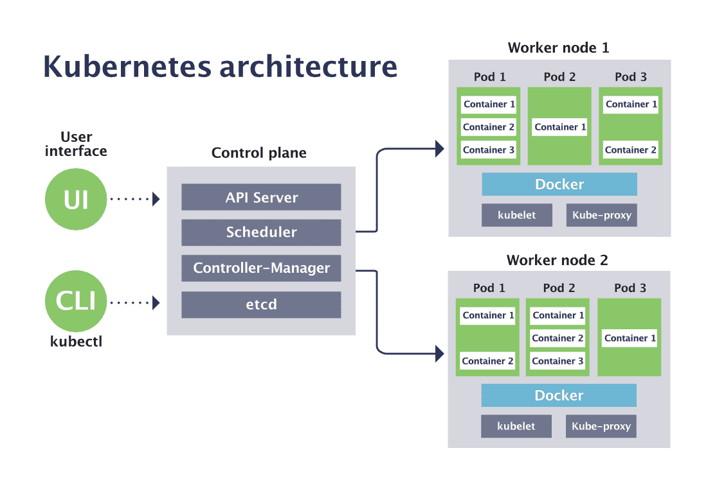

# Introducción a Kubernetes

## ¿Qué es la orquestación de contenedores?

En el desarrollo moderno, los **contenedores** permiten empaquetar una aplicación junto con su sistema operativo base, dependencias y configuración. Esto garantiza que se ejecute igual en cualquier entorno, ya sea un portátil, un servidor físico o una nube.

Sin embargo, cuando se trabaja con **decenas o cientos de contenedores** (como ocurre en las arquitecturas de microservicios), es necesaria una herramienta que los **gestione automáticamente**: cree, escale, reinicie, actualice o elimine contenedores según las necesidades del sistema. A esto se le llama **orquestación de contenedores**.

### Funcionalidades principales

- Despliegue automático de contenedores.
- Escalado horizontal (añadir o quitar réplicas).
- Supervisión del estado de los servicios.
- Reinicio automático ante fallos.
- Balanceo de carga interno.
- Actualizaciones sin interrupción (*rolling updates*).
- Gestión de configuraciones y secretos.
- Almacenamiento persistente para datos.

---

## ¿Qué es Kubernetes?

**Kubernetes** (también conocido como **K8s**, por las 8 letras entre la “K” y la “s”) es una plataforma **de código abierto** diseñada para automatizar el despliegue, escalado y operación de contenedores.

Fue creada por **Google**, basada en su experiencia interna con Borg, y actualmente es mantenida por la **Cloud Native Computing Foundation (CNCF)**. Es el estándar de facto en la industria para orquestar contenedores tanto en entornos locales como en la nube.

### Objetivos principales

- Automatizar el despliegue y la gestión de contenedores.
- Asegurar alta disponibilidad y tolerancia a fallos.
- Facilitar el despliegue continuo (*CI/CD*).
- Simplificar el escalado horizontal y vertical.
- Garantizar portabilidad entre diferentes proveedores cloud.

---

## Características principales de Kubernetes

- **Despliegue automatizado** de aplicaciones en contenedores.
- **Auto-reparación**: reinicia contenedores que fallan o se pierden.
- **Actualizaciones sin interrupciones** y posibilidad de *rollback*.
- **Balanceo de carga** y resolución DNS interna.
- **Gestión de almacenamiento persistente** (PVs y PVCs).
- **Configuración y secretos** centralizados (ConfigMaps y Secrets).
- **Infraestructura declarativa** mediante archivos YAML.
- **Extensibilidad**: admite controladores y operadores personalizados.
- **Portabilidad**: puede ejecutarse en local (Minikube, Kind) o en la nube (GKE, EKS, AKS).

---

# Arquitectura de Kubernetes

Kubernetes tiene una arquitectura **cliente-servidor** dividida en dos componentes principales: el **Control Plane** (o plano de control) y los **nodos de trabajo** (*worker nodes*).



## Control Plane (nodo maestro)

Es el cerebro de Kubernetes: gestiona el estado deseado del clúster y toma decisiones sobre dónde y cómo se ejecutan los contenedores.

- **`kube-apiserver`** → expone la API REST de Kubernetes; es el punto central de comunicación.
- **`etcd`** → almacén clave-valor que guarda todo el estado del clúster.
- **`kube-scheduler`** → decide en qué nodo ejecutar cada Pod.
- **`controller-manager`** → supervisa los recursos y aplica acciones automáticas (crear, eliminar, reiniciar).
- **`cloud-controller-manager`** → integra el clúster con el proveedor cloud (opcional).

## Worker Nodes (nodos de trabajo)

Son las máquinas (físicas o virtuales) donde realmente se ejecutan los contenedores.

- **`kubelet`** → agente que comunica con el Control Plane y garantiza que los contenedores funcionen según lo previsto.
- **`kube-proxy`** → gestiona el tráfico de red hacia los Pods y el balanceo de carga.
- **Container Runtime** → software que ejecuta los contenedores (ej: containerd, CRI-O, Docker).

---

# Recursos fundamentales de Kubernetes

Kubernetes se organiza en torno a objetos que describen el estado deseado del clúster: aplicaciones desplegadas, recursos de red, almacenamiento, seguridad, etc.  
La siguiente tabla resume los principales **recursos fundamentales**:

| Elemento | Descripción | Ejemplo de uso |
|-----------|-------------|----------------|
| **Pod** | Unidad mínima de ejecución. Puede contener uno o varios contenedores. | Un microservicio web con Nginx. |
| **Deployment** | Gestiona réplicas de Pods, actualizaciones y *rollbacks*. | Escalar un servicio de API REST. |
| **StatefulSet** | Mantiene identidad y almacenamiento fijo para cada Pod. | Despliegue de una base de datos. |
| **DaemonSet** | Ejecuta un Pod en cada nodo del clúster. | Agente de monitorización. |
| **Job / CronJob** | Ejecución única o programada de tareas. | Generar informes diarios. |
| **Service** | Expone un conjunto de Pods con una IP estable. | Balancear tráfico entre réplicas. |
| **Ingress** | Reglas HTTP/HTTPS externas para acceder a servicios. | Exponer una aplicación web pública. |
| **Namespace** | Aislamiento lógico de recursos. | Separar dev/test/prod. |
| **ConfigMap** | Guardar configuraciones no sensibles. | Variables de entorno de una app. |
| **Secret** | Guardar datos sensibles (tokens, contraseñas). | Credenciales de base de datos. |
| **Volume / PVC** | Almacenamiento persistente para datos. | Guardar logs o archivos. |
| **StorageClass** | Define la política de aprovisionamiento dinámico de volúmenes. | Crear PVC automáticamente. |
| **RBAC (Roles, Bindings)** | Controla permisos y acceso a recursos. | Limitar acciones de un usuario. |
| **Autoscaler (HPA/VPA)** | Escala Pods horizontal o verticalmente. | Adaptar la carga de trabajo. |
| **NetworkPolicy** | Define reglas de tráfico entre Pods. | Aislar servicios críticos. |

---

## Pods

El **Pod** es la unidad mínima de ejecución en Kubernetes. Contiene uno o varios contenedores que comparten red y volúmenes.

### Tipos de Pods (por uso)

| Tipo | Descripción | Ejemplo |
|------|-------------|----------|
| **Independiente** | Creado manualmente, sin controladores. | Prueba puntual de un contenedor. |
| **Controlado** | Gestionado por Deployment, StatefulSet, etc. | Servicio web replicado. |
| **Multi-container** | Varios contenedores colaboran en el mismo Pod. | Patrón *sidecar* (proxy + app). |
| **Efímero** | Añadido temporalmente para depurar. | `kubectl debug pod` |

Ejemplo básico:

```yaml
apiVersion: v1
kind: Pod
metadata:
  name: ejemplo-pod
spec:
  containers:
    - name: nginx
      image: nginx:1.27-alpine
      ports:
        - containerPort: 80
```

---

## Controladores de Pods (*Controllers*)

Los *Controllers* gestionan la creación, actualización y disponibilidad de los Pods. Permiten despliegues declarativos y tolerancia a fallos.

| Tipo | Características | Uso típico |
|------|------------------|-------------|
| **Deployment** | Gestiona réplicas y actualizaciones continuas. | Aplicaciones sin estado. |
| **StatefulSet** | Mantiene identidad y almacenamiento persistente. | BBDD, Kafka, Redis… |
| **DaemonSet** | Un Pod por nodo, ideal para servicios del sistema. | Agentes de logs o métricas. |
| **Job** | Ejecuta una tarea única y finaliza. | Procesamiento batch. |
| **CronJob** | Lanza Jobs de forma periódica. | Backups, tareas programadas. |

Ejemplo de Deployment:

```yaml
apiVersion: apps/v1
kind: Deployment
metadata:
  name: webapp
spec:
  replicas: 3
  strategy:
    type: RollingUpdate
  selector:
    matchLabels:
      app: webapp
  template:
    metadata:
      labels:
        app: webapp
    spec:
      containers:
        - name: nginx
          image: nginx:1.27-alpine
          ports:
            - containerPort: 80
```

Ejemplo de CronJob:

```yaml
apiVersion: batch/v1
kind: CronJob
metadata:
  name: limpieza-logs
spec:
  schedule: "0 2 * * *"
  jobTemplate:
    spec:
      template:
        spec:
          containers:
            - name: limpieza
              image: busybox
              command: ["sh", "-c", "rm -rf /var/log/*.log"]
          restartPolicy: OnFailure
```

---

## Services

Los **Services** proporcionan un punto de acceso estable a un conjunto de Pods, que pueden recrearse o cambiar de IP.

| Tipo | Descripción | Uso típico |
|------|-------------|------------|
| **ClusterIP** | IP interna accesible solo dentro del clúster. | Comunicación entre microservicios. |
| **NodePort** | Abre un puerto en el nodo accesible desde fuera. | Pruebas locales con Minikube. |
| **LoadBalancer** | Crea un balanceador externo (cloud). | Aplicaciones en producción. |
| **ExternalName** | Redirige a un dominio externo. | Servicios externos. |

Ejemplo con NodePort:

```yaml
apiVersion: v1
kind: Service
metadata:
  name: web-service
spec:
  selector:
    app: web
  ports:
    - port: 80
      targetPort: 8080
      nodePort: 31000
  type: NodePort
```

---

## Ingress y NetworkPolicy

### Ingress

Define reglas HTTP/HTTPS externas para acceder a los *Services*.

Ejemplo básico:

```yaml
apiVersion: networking.k8s.io/v1
kind: Ingress
metadata:
  name: web-ingress
  annotations:
    nginx.ingress.kubernetes.io/rewrite-target: /
spec:
  rules:
    - host: app.local
      http:
        paths:
          - path: /
            pathType: Prefix
            backend:
              service:
                name: web-service
                port:
                  number: 80
```

### NetworkPolicy

Las **NetworkPolicies** controlan el tráfico de red entre Pods.

| Tipo | Descripción | Ejemplo |
|------|-------------|---------|
| **Ingress** | Define qué tráfico puede entrar a un Pod. | Solo aceptar conexiones de un namespace concreto. |
| **Egress** | Define la salida de tráfico desde un Pod. | Limitar el acceso a Internet. |

Ejemplo:

```yaml
apiVersion: networking.k8s.io/v1
kind: NetworkPolicy
metadata:
  name: permitir-app
spec:
  podSelector:
    matchLabels:
      app: backend
  ingress:
    - from:
        - podSelector:
            matchLabels:
              app: frontend
```

---

## ConfigMaps y Secrets

Permiten **parametrizar aplicaciones** sin modificar imágenes.

| Tipo | Contenido | Persistencia | Ejemplo |
|------|------------|--------------|----------|
| **ConfigMap** | Configuración no sensible. | No cifrado. | Nombre de aplicación, modo debug. |
| **Secret** | Datos sensibles (tokens, contraseñas). | Codificado base64. | Credenciales, claves API. |

Ejemplo de ConfigMap:

```yaml
apiVersion: v1
kind: ConfigMap
metadata:
  name: app-config
data:
  modo: produccion
  port: "8080"
```

Ejemplo de Secret:

```yaml
apiVersion: v1
kind: Secret
metadata:
  name: db-secret
type: Opaque
data:
  usuario: YWRtaW4=
  contrasinal: c2VjcmV0
```

Montaje como variables de entorno:

```yaml
envFrom:
  - configMapRef:
      name: app-config
  - secretRef:
      name: db-secret
```

---

## Volúmenes, PVC y StorageClass

Los contenedores son efímeros, por lo que Kubernetes emplea **Volúmenes** para persistir datos.

### Tipos de Volúmenes

| Tipo | Descripción | Persistencia |
|------|-------------|--------------|
| **emptyDir** | Directorio temporal, se elimina con el Pod. | ❌ |
| **hostPath** | Directorio del nodo anfitrión. | ⚠️ (dependiente del nodo) |
| **configMap / secret** | Volumen generado desde esos recursos. | ⚠️ |
| **persistentVolumeClaim (PVC)** | Volumen provisionado dinámicamente. | ✅ |

Ejemplo de PVC:

```yaml
apiVersion: v1
kind: PersistentVolumeClaim
metadata:
  name: datos-app
spec:
  accessModes:
    - ReadWriteOnce
  resources:
    requests:
      storage: 1Gi
```

Ejemplo de uso en un Deployment:

```yaml
volumeMounts:
  - name: datos
    mountPath: /usr/share/nginx/html
volumes:
  - name: datos
    persistentVolumeClaim:
      claimName: datos-app
```

### StorageClass

Define el tipo de almacenamiento y la política de aprovisionamiento:

```yaml
apiVersion: storage.k8s.io/v1
kind: StorageClass
metadata:
  name: rapido
provisioner: kubernetes.io/aws-ebs
parameters:
  type: gp2
reclaimPolicy: Delete
volumeBindingMode: Immediate
```

---

## Namespaces

Los **Namespaces** permiten dividir el clúster en espacios lógicos aislados.  
Es útil para separar entornos (*dev*, *test*, *prod*) o equipos.

```yaml
apiVersion: v1
kind: Namespace
metadata:
  name: dev
```

Comandos útiles:

```bash
kubectl get namespaces
kubectl get pods -n dev
```

---

## RBAC (Roles y permisos)

El sistema **RBAC** (*Role-Based Access Control*) controla quién puede hacer qué acciones sobre qué recursos.

| Recurso | Función | Alcance |
|----------|----------|---------|
| **Role** | Define permisos en un namespace. | Local |
| **ClusterRole** | Define permisos globales. | Clúster |
| **RoleBinding** | Asocia Role a usuario/grupo. | Local |
| **ClusterRoleBinding** | Asocia ClusterRole. | Global |
| **ServiceAccount** | Identidad usada por los Pods. | Namespace |

Ejemplo de Role y RoleBinding:

```yaml
apiVersion: rbac.authorization.k8s.io/v1
kind: Role
metadata:
  name: lector-pods
  namespace: dev
rules:
  - apiGroups: [""]
    resources: ["pods"]
    verbs: ["get", "list"]
---
apiVersion: rbac.authorization.k8s.io/v1
kind: RoleBinding
metadata:
  name: vinculo-lector
  namespace: dev
subjects:
  - kind: User
    name: ana
roleRef:
  kind: Role
  name: lector-pods
  apiGroup: rbac.authorization.k8s.io
```

---

## Autoscalers

Los **Autoscalers** permiten adaptar automáticamente los recursos según la carga.

| Tipo | Descripción | Ajuste |
|------|-------------|--------|
| **HorizontalPodAutoscaler (HPA)** | Escala número de réplicas. | Horizontal |
| **VerticalPodAutoscaler (VPA)** | Ajusta CPU/memoria de un Pod. | Vertical |

Ejemplo de HPA:

```yaml
apiVersion: autoscaling/v2
kind: HorizontalPodAutoscaler
metadata:
  name: api-hpa
spec:
  scaleTargetRef:
    apiVersion: apps/v1
    kind: Deployment
    name: api
  minReplicas: 2
  maxReplicas: 5
  metrics:
    - type: Resource
      resource:
        name: cpu
        target:
          type: Utilization
          averageUtilization: 75
```

---

## Esquema general de relación entre recursos

```
[User / DevOps]
       |
   [kubectl / API Server]
       |
 [Namespace: dev/test/prod]
       |
 [Deployment / StatefulSet / DaemonSet]
       |
     [Pods] <---> [ConfigMap / Secret / PVC]
       |
   [Service] <---> [Ingress / NetworkPolicy]
       |
 [Cluster networking + Autoscaling]
```

---

# Configuración con YAML

Kubernetes funciona de forma **declarativa**: definimos el estado deseado del sistema y el clúster se encarga de hacer que el estado real coincida con él. Al crear un objeto en YAML estamos diciendo: “esto es lo que quiero que tenga mi clúster”.

## Estructura básica de un manifiesto

```yaml
apiVersion: <grupo/versión>
kind: <Recurso>
metadata:
  name: <nombre>
  namespace: <opcional>
  labels:
    app: <etiqueta>
spec:
  # Contenido específico del recurso
```

### Significado de cada apartado
- **apiVersion**: Indica el grupo de API y versión del recurso.  
- **kind**: Tipo de objeto que se crea.  
- **metadata**: Información de identificación: nombre, etiquetas, etc.  
- **spec**: La configuración deseada (el estado “querido”).  
- (Los objetos también tienen un campo `status`, gestionado por Kubernetes).

---

## Parámetros típicos por recurso

### Pod y Contenedores

Los **Pods** son la unidad mínima de ejecución. Muchos recursos (Deployment, Job…) crean Pods según su propia configuración.

#### Campos habituales en `spec` de un Pod

| Campo | Descripción | Ejemplo |
|--------|-------------|---------|
| `containers[]` | Lista de contenedores principales. | `image: nginx:1.27-alpine` |
| `initContainers[]` | Contenedores que se ejecutan antes. | Migraciones de BD. |
| `volumes[]` | Volúmenes disponibles. | PVC, ConfigMap, Secret… |
| `restartPolicy` | Política de reinicio. | `Always` |
| `nodeSelector` / `affinity` | Programación de Pods en nodos. | Afinidad por etiquetas. |
| `serviceAccountName` | Cuenta de servicio asociada. | `ansible-service` |

#### Campos típicos de `containers[]`

| Campo | Descripción | Ejemplo |
|--------|-------------|---------|
| `name` | Nombre interno del contenedor. | `web` |
| `image` | Imagen a desplegar. | `nginx:alpine` |
| `ports[]` | Puertos expuestos. | `containerPort: 80` |
| `env` / `envFrom` | Variables de entorno. | `envFrom: configMapRef:` |
| `resources.requests/limits` | CPU/RAM. | `cpu: "100m"` |
| `volumeMounts[]` | Montaje de volúmenes. | `/data` |
| `livenessProbe` / `readinessProbe` | Comprobaciones de salud. | HTTP GET |

Ejemplo mínimo de Pod:

```yaml
apiVersion: v1
kind: Pod
metadata:
  name: ejemplo-pod
spec:
  containers:
    - name: web
      image: nginx:1.27-alpine
      ports:
        - containerPort: 80
```

---

### Deployment (apps/v1)

Un **Deployment** gestiona la creación y actualización de Pods idénticos.

#### Campos habituales

| Campo | Descripción | Ejemplo |
|--------|-------------|---------|
| `replicas` | Número de réplicas. | `3` |
| `selector.matchLabels` | Debe coincidir con el template. | `app: webapp` |
| `template.metadata.labels` | Etiquetas de los Pods. | `app: webapp` |
| `template.spec.containers` | Contenedores del Pod. | `image: nginx:alpine` |
| `strategy.type` | Estrategia de actualización. | `RollingUpdate` |
| `minReadySeconds` | Tiempo mínimo antes de estar listo. | `5` |

Ejemplo:

```yaml
apiVersion: apps/v1
kind: Deployment
metadata:
  name: webapp
spec:
  replicas: 3
  selector:
    matchLabels:
      app: webapp
  template:
    metadata:
      labels:
        app: webapp
    spec:
      containers:
        - name: web
          image: nginx:latest
          ports:
            - containerPort: 80
```

---

## Plantillas mínimas para comenzar

### 1) Deployment + Service

```yaml
apiVersion: apps/v1
kind: Deployment
metadata:
  name: myapp
spec:
  replicas: 2
  selector:
    matchLabels:
      app: myapp
  template:
    metadata:
      labels:
        app: myapp
    spec:
      containers:
        - name: web
          image: nginx:1.27-alpine
          ports:
            - containerPort: 80
---
apiVersion: v1
kind: Service
metadata:
  name: myapp
spec:
  type: ClusterIP
  selector:
    app: myapp
  ports:
    - port: 80
      targetPort: 80
```

### 2) Ingress para el servicio anterior

```yaml
apiVersion: networking.k8s.io/v1
kind: Ingress
metadata:
  name: myapp-ingress
spec:
  rules:
    - host: myapp.local
      http:
        paths:
          - path: /
            pathType: Prefix
            backend:
              service:
                name: myapp
                port:
                  number: 80
```

### 3) ConfigMap + uso en el Deployment

```yaml
apiVersion: v1
kind: ConfigMap
metadata:
  name: app-config
data:
  MODE: "production"
  PORT: "8080"
---
apiVersion: apps/v1
kind: Deployment
metadata:
  name: myapp-config
spec:
  selector:
    matchLabels:
      app: myapp-config
  template:
    metadata:
      labels:
        app: myapp-config
    spec:
      containers:
        - name: web
          image: nginx:1.27-alpine
          envFrom:
            - configMapRef:
                name: app-config
```

### 4) Secret + montaje como env

```yaml
apiVersion: v1
kind: Secret
metadata:
  name: db-secret
type: Opaque
data:
  DB_USER: YWRtaW4=        # “admin” en base64
  DB_PASS: c2VjcmV0        # “secret” en base64
---
apiVersion: apps/v1
kind: Deployment
metadata:
  name: api
spec:
  selector:
    matchLabels:
      app: api
  template:
    metadata:
      labels:
        app: api
    spec:
      containers:
        - name: api
          image: ghcr.io/example/api:1.0
          envFrom:
            - secretRef:
                name: db-secret
```

### 5) PVC + uso en un Deployment

```yaml
apiVersion: v1
kind: PersistentVolumeClaim
metadata:
  name: data
spec:
  accessModes: [ ReadWriteOnce ]
  resources:
    requests:
      storage: 1Gi
---
apiVersion: apps/v1
kind: Deployment
metadata:
  name: files
spec:
  selector:
    matchLabels:
      app: files
  template:
    metadata:
      labels:
        app: files
    spec:
      containers:
        - name: web
          image: nginx:1.27-alpine
          volumeMounts:
            - name: data
              mountPath: /usr/share/nginx/html
      volumes:
        - name: data
          persistentVolumeClaim:
            claimName: data
```

---

# Escalado y actualizaciones

## Escalado manual

```bash
kubectl scale deployment webapp --replicas=5
```

## Escalado automático

```bash
kubectl autoscale deployment webapp --min=2 --max=10 --cpu-percent=70
```

## Actualizaciones

```bash
kubectl set image deployment/webapp web=nginx:1.25
kubectl rollout status deployment/webapp
kubectl rollout undo deployment/webapp
```

---

# Monitorización y depuración

Comandos útiles:

```bash
kubectl get pods -o wide
kubectl logs <pod>
kubectl exec -it <pod> -- sh
kubectl top pods
kubectl describe pod <pod>
```

En Minikube:

```bash
minikube addons enable metrics-server
```

Herramientas externas: **Prometheus**, **Grafana**, **Lens**, **K9s**.

---

# Resumen final

| Elemento | Función principal |
|-----------|-------------------|
| **Pod** | Unidad mínima de ejecución |
| **Deployment** | Control de réplicas y versiones |
| **Service** | Comunicación estable entre Pods |
| **Ingress** | Acceso HTTP/HTTPS externo |
| **ConfigMap / Secret** | Configuración y secretos |
| **Volume / PVC** | Almacenamiento persistente |
| **HPA** | Escalado automático |
| **Probe** | Control de salud y disponibilidad |

---

**Autor:** Adrián Blanco  
**Centro:** CE CIFP A Carballeira  
**Fecha:** Noviembre 2025
