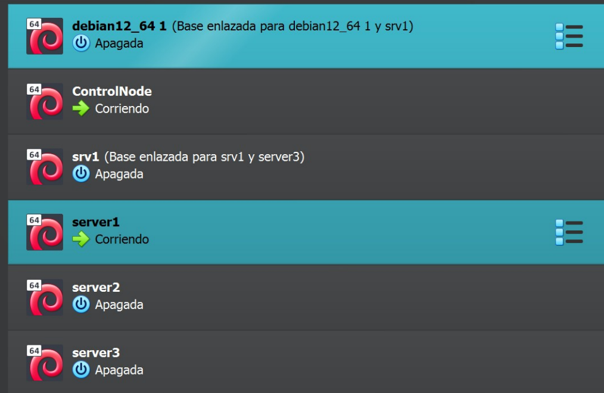

# Ansible
## 1. Introdución

### Que é Ansible?

Ansible é unha ferramenta de automatización sen axentes, usada para:

- Configurar sistemas.
- Despregue de aplicacións.
- Xestión de infraestruturas.
- Orquestración de tarefas complexas.

Está baseada en SSH, usa ficheiros YAML e destaca por ser sinxela, declarativa e idempotente (as tarefas poden repetirse sen efectos secundarios).

### Elementos básicos

| Elemento       | Descrición |
|----------------|------------|
| Inventario     | Lista de hosts que Ansible pode xestionar. |
| Playbook       | Conxunto de tarefas descritas en YAML que se aplican a un ou varios hosts. |
| Task           | Cada acción individual (ex: instalar paquete, copiar ficheiro). |
| Role           | Conxunto estruturado de tarefas, templates, handlers, variables, etc. |
| Module         | Comando específico de Ansible (ex: `apt`, `yum`, `copy`, `user`, etc.). |
| Handler        | Acción que se executa se unha tarefa cambia algo (ex: reiniciar un servizo). |
| Facts          | Información recollida automaticamente dos hosts (IP, SO, memoria, etc.). |

### Exemplo de inventario

```ini
[web]
192.168.1.10
192.168.1.11

[db]
192.168.1.12 ansible_user=root
```

### Exemplo sinxelo de playbook

```yaml
---
- name: Instalar Apache en servidores web
  hosts: web
  become: true
  tasks:
    - name: Instalar apache
      apt:
        name: apache2
        state: present
        update_cache: yes

    - name: Asegurar que apache está iniciado
      service:
        name: apache2
        state: started
        enabled: true
```

### Comandos básicos

```bash
# Verificar conexión aos hosts
ansible all -m ping

# Executar unha tarefa ad-hoc
ansible web -m apt -a "name=htop state=present" --become

# Executar un playbook
ansible-playbook site.yml

# Usar inventario personalizado
ansible-playbook -i inventario.ini site.yml
```

### Módulos comúns

| Módulo     | Uso                       |
|------------|---------------------------|
| ping       | Proba de conexión.         |
| copy       | Copiar ficheiros.         |
| template   | Copiar con Jinja2.         |
| apt / yum  | Xestores de paquetes.      |
| service    | Xestionar servizos.        |
| user       | Crear/eliminar usuarios.   |
| file       | Permisos, enlaces, etc.    |

### Boas prácticas

- Usar roles para organizar tarefas complexas.
- Separar variables en `vars/` ou `group_vars/`.
- Evitar duplicación usando `with_items` ou `loops`.
- Manter handlers para accións condicionais como reinicios.

## 2. Escenario de prácticas

Para o seguimento deste material farase uso do **hipervisor VirtualBox**, onde teremos diferentes máquinas virtuais.

Estas máquinas virtuais terán dous adaptadores de rede:  
- **Rede interna**: para conectividade entre elas  
- **NAT**: para acceso ao exterior  

Ademais, as máquinas contarán con **asignación de enderezos IP por DHCP**.
Para iso, podemos configurar un servidor dhcp para a rede interna de virtualbox:

```powershell
"C:\Program files\oracle\virtualbox\VBoxManage.exe" dhcpserver add --netname intnet --ip 192.168.1.1 --netmask
255.255.255.0 --lowerip 192.168.1.2 --upperip 192.168.1.254 --enable
```
En cada máquina virtual (podemos facelo sobre a plantilla xa) temos que configurar o `/etc/network/interfaces`:
```bash
auto enp0s8
iface enp0s8 inet dhcp
```

Será necesario, para realizar conexións por SSH, establecer un **mapeo do porto interno 22** de cada máquina ao **porto externo** que o usuario decida utilizar para se conectar por CLI.

### Notas

**Nota 1:** Os enderezos IP poden variar segundo o usuario que siga o material.  
**Nota 2:** Recoméndase **non apagar** as máquinas, senón **gardar o seu estado** para retomar facilmente a práctica.  
**Nota 3:** Pode darse o caso de que algunhas máquinas **perdan a hora actual**, o que pode impedir realizar instalacións ou outras tarefas.

Podemos comprobalo e solucionalo:

```bash
usuario@debian:~$ date
lun 03 nov 2025 10:14:25 CET

usuario@debian:~$ sudo date -s "2025-11-03 10:30:00"
lun 03 nov 2025 10:30:00 CET

usuario@debian:~$ date
lun 03 nov 2025 10:30:07 CET

usuario@debian:~$ sudo date -s "11/03/2025 10:15"
lun 03 nov 2025 10:15:00 CET

usuario@debian:~$ date
lun 03 nov 2025 10:15:01 CET
```

### Instalación de Debian 12 en VirtualBox

A imaxe ISO de Debian 12 pódese descargar aquí:  
[Descargar ISO Debian 12](https://cdimage.debian.org/debian-cd/current/amd64/iso-cd/debian-13.2.0-amd64-netinst.iso)

### Configuración da máquina virtual

- **Memoria base:** 4096 MB  
- **Procesadores:** 4  
- **Almacenamento:** 50 GB  
- **Usuario:** `user` (contrasinal: `user`)  
- **Root:** contrasinal: `<espazo>` (barra espazadora)  

#### Rede  
Configuraranse na plantilla os seguintes adaptadores:
- Adaptador 1 → Avanzado → Reenvío de portos:
  - *Porto anfitrión:* 2222 (Por exemplo. Hai que cambialo en cada clonación).  
  - *Porto convidado:* 22  
- Adaptador 2 → rede interna → intnet

### Máquinas necesarias en VirtualBox

En VirtualBox teremos unha máquina inicial e realizaremos **dúas clonacións enlazadas**:

- **AMN:** *Ansible Management Node*  
- **srv_template:** actúa como plantilla para os nodos xestionados  

### Instalación do servidor SSH

Tras finalizar a instalación de Debian 12, abrir unha terminal e executar:

```bash
apt update
apt install openssh-server -y
```

Con isto, xa podemos conectarnos dende o anfitrión:

```bash
ssh -p 2222 user@localhost
```

### Contorno en VirtualBox

A continuación móstrase un posible grupo de máquinas en VirtualBox para o seguimento do material.


## 3. Instalación de Ansible

Unha vez creadas as máquinas de **nodo controlador** e **plantilla** para os servidores coa súa correspondente IP, procedemos coa instalación manual de **Ansible**.

En primeiro lugar é recomendable cambiar o nome do host:
```bash
hostnamectl set-hostname ControlNode
```

Despois disto é recomendable reiniciar.

Para instalar Ansible é necesario dispoñer previamente de **Python**, xa que este é o motor sobre o que se executa a ferramenta.  
Ansible está desenvolvida principalmente en Python, polo que depende del tanto para o seu funcionamento básico como para a execución dos seus módulos.

```bash
user@ControlNode:~$ python3 --version
Python 3.11.2
```

### Instalación de pip

O seguinte paso consiste en instalar **pip**, o xestor de paquetes de Python.

```bash
root@ControlNode:~# apt update && apt install -y python3-pip
...
root@ControlNode:~# python3 -m pip -V
pip 23.0.1
```

### Instalación recomendada de Ansible en Debian 12

```bash
root@ControlNode:~# pip install ansible --break-system-packages
```

### Verificación

```bash
root@ControlNode:~# ansible --version
ansible [core 2.19.2]
...
```

### Documentación e `ansible-doc`
A documentación ofical de ansible está dispoñible nesta [ligazón](https://docs.ansible.com).

Outra forma de consultar a documentación e mediante o comando `ansible-doc`. Así, por exemplo, podemos consultar a documentación sobre un `módulo` (elemento mínimo de ansible destinado a unha tarefa determinada) concreto:
```bash
root@ControlNode:~# ansible-doc -l
...
root@ControlNode:~# ansible-doc -s ping
```
## 4. Configuración dos nodos xestionados

A continuación explícase o proceso de configuración dos nodos que serán administrados desde o **nodo controlador** onde se instalou Ansible. Para a xestión destes nodos necesitamos seguir os seguintes pasos:

### Proceso a seguir

#### Paso 1: Python instalado
No noso caso, a máquina xa conta co intérprete de Python instalado:

```bash
user@srvTemplate:~$ python3 --version
Python 3.11.2
```

#### Paso 2: Ter un servidor SSH
A máquina tamén conta cun servidor SSH instalado. Se non estivera presente, sería necesaria a súa instalación:

```bash
apt update
apt install openssh-server -y
```


#### Paso 3: Crear un usuario con permisos de sudo
É necesario crear un usuario para traballar e outorgarlle permisos de administración mediante sudo.

#### Paso 4: Copiar claves SSH dende o ControlNode
Debemos copiar a clave pública SSH do usuario do **ControlNode** ao usuario desexado nos nodos xestionados.

#### Paso 5: Configuración de sudo en caso de usar un usuario `ansible`
Será necesario crear o usuario e configurar `/etc/sudoers`.

---

### Instalación de Python (nos nodos xestionados)

```bash
user@srvTemplate:~$ python3 --version
Python 3.11.2
```

---

### Servidor SSH

Se é necesario instalar o servidor SSH:

```bash
apt update
apt install openssh-server -y
```

---

### Creación do usuario *ansible* no ControlNode e nos nodos xestionados.

Antes creamos a ferramenta **whois** para xerar contrasinais cifradas.

#### No ControlNode:

```bash
root@ControlNode:~# apt install -y whois
root@ControlNode:~# useradd -m -d /home/ansible -p "$(mkpasswd 'ansible')" -s /bin/bash ansible
root@ControlNode:~# grep ansible /etc/passwd
ansible:x:1001:1001::/home/ansible:/bin/bash
```

#### No srvTemplate:

```bash
root@srvTemplate:~# apt install -y whois
root@srvTemplate:~# useradd -m -d /home/ansible -p "$(mkpasswd 'ansible')" -s /bin/bash ansible
root@srvTemplate:~# grep ansible /etc/passwd
ansible:x:1001:1001::/home/ansible:/bin/bash
```

---

### Creación do par de claves SSH
Dende `AMN`:

```bash
ansible@ControlNode:~$ ssh-keygen
ansible@ControlNode:~$ ls .ssh/
id_rsa  id_rsa.pub

ansible@ControlNode:~$ ssh-copy-id -i .ssh/id_rsa.pub ansible@192.168.122.5
```

Verificación en `srvTemplate`:

```bash
ansible@srvTemplate:~$ ls .ssh/
authorized_keys
ansible@srvTemplate:~$ cat .ssh/authorized_keys
ssh-rsa AAAAB3...
```

Probamos conexión:

```bash
ansible@ControlNode:~$ ssh 192.168.122.5
```

Nota: Isto só funciona co usuario *ansible*. Outros usuarios seguirán requirindo contrasinal.

---

### Instalación de sudo

```bash
root@srvTemplate:~# apt update && apt install -y sudo
```

Editar `/etc/sudoers` con **visudo**:

```bash
root@srvTemplate:~# visudo
ansible ALL=(ALL:ALL) NOPASSWD:ALL
```

---

### Comprobación da conexión
Chegados a este punto é recomendable configurar dende o host ssh e VS Code para traballar na máquina `AMN` co usuario `ansible`. Pódese seguir a [guía de uso de vscode e ssh](00.guia_ssh.md)

Creamos unha máquina *srv1* a partir da plantilla e definimos un ficheiro `hosts`:

```bash
srv1 ansible_host=192.168.10.6 ansible_user=ansible ansible_become=yes
```

Probamos o módulo *ping*:

```bash
ansible@ControlNode:~/practicas/pr01$ ansible -i hosts srv1 -m ping
srv1 | SUCCESS => {
 "ping": "pong"
}
```

---

### Execución dun playbook de proba

```yaml
---
- name: Playbook inicial
  hosts: srv1
  tasks:
    - name: Instalar os paquetes zip e unzip
      ansible.builtin.apt:
        name:
          - zip
          - unzip
        state: present

    - name: Crear un ficheiro /home/user/ejemplo con permisos 777
      ansible.builtin.file:
        path: /home/user/ejemplo
        state: touch
        owner: root
        group: root
        mode: "0777"

    - name: Engadir a cadea 'hola' ao ficheiro
      ansible.builtin.shell: |
        if test "$(tail -1 /home/user/ejemplo)" != "hola"
        then
          echo "hola" >> /home/user/ejemplo
        fi

```

Execución:

```bash
ansible-playbook playbook.yaml
```

Resultado:

```bash
PLAY RECAP
srv1 : ok=5 changed=4 unreachable=0 failed=0
```

Comprobación en `srv1`:

```bash
ansible@srv1:~$ sudo ls /home/user/ejemplo
ansible@srv1:~$ sudo cat /home/user/ejemplo
hola
ansible@srv1:~$ sudo ls -l /home/user/ejemplo
-rwxrwxrwx 1 root root 5 nov 4 09:21 /home/user/ejemplo

```
## 5. O comando `ansible`:

### Estrutura de directorios e inventario

Antes de executar comandos ad-hoc con Ansible, recoméndase crear un directorio de traballo e un ficheiro de inventario:

```bash
mkdir -p practicas/pr01
cd practicas/pr01
touch hosts
```

Exemplo dun ficheiro **hosts**:

```ini
[servers]
srv1 ansible_host=192.168.10.6 ansible_user=ansible ansible_become=yes
srv2 ansible_host=192.168.10.5 ansible_user=ansible ansible_become=yes
```

---

### Sintaxe básica do comando `ansible`

Todos os comandos ad-hoc seguen esta estrutura:

```bash
ansible -i INVENTARIO DESTINO -m MÓDULO -a "ARGUMENTOS" [-b]
```

- **INVENTARIO** → Ficheiro co listado de máquinas.
- **DESTINO** → Máquina ou grupo do inventario.
- **MÓDULO** → Ferramenta que executa a acción (ping, copy, apt…).
- **ARGUMENTOS** → Parámetros do módulo.
- **-b / --become** → Escalada de privilexios (sudo).

---

### Exemplo 1: Probar conexión co módulo `ping`

```bash
ansible -i hosts srv1 -m ping
```

Saída esperada:

```json
srv1 | SUCCESS => {
  "changed": false,
  "ping": "pong"
}
```

---

### Exemplo 2: Copiar un ficheiro remoto co módulo `copy`

```bash
echo "Ficheiro de exemplo" > /tmp/meu_ficheiro.txt

ansible -i hosts srv1 -m copy -a "src=/tmp/meu_ficheiro.txt dest=/tmp/copia.txt mode=0644"
```

---

### Exemplo 3: Instalar paquetes co módulo `apt`

```bash
ansible -i hosts srv1 -m apt -a "name=apache2 state=present update_cache=yes" -b
```

Este comando:

- Actualiza repositorios.
- Instala *apache2*.
- Emprega sudo grazas ao parámetro `-b`.

---

## 6. Ficheiro de configuración e inventario en Ansible 

### 1. Ficheiro de configuración (`ansible.cfg`)

O ficheiro **ansible.cfg** define o comportamento de Ansible. A orde de búsqueda é:

1. Variable de contorno `ANSIBLE_CONFIG`
2. `ansible.cfg` no directorio actual
3. `~/.ansible.cfg` no home do usuario
4. `/etc/ansible/ansible.cfg`

Se a instalación se fixo con **pip**, normalmente non existe un ficheiro inicial.  
Pode xerarse así:

```bash
ansible-config init --disabled > ansible.cfg
```

Exemplo básico:

```ini
[defaults]
inventory = ./hosts
forks = 50
```

Outras seccións habituais:

```ini
[privilege_escalation]
become = yes
become_user = ansible
```

---

### 2. Inventario en Ansible

O inventario define os nodos que Ansible administra. Pode escribirse en formato **INI** ou **YAML**.

#### Exemplo INI:

```ini
srv1 ansible_host=192.168.10.6 ansible_user=ansible ansible_become=yes

[debian]
ubuntu ansible_host=192.168.10.7 ansible_user=ansible ansible_become=yes

[red_hat]
centos ansible_host=192.168.10.8 ansible_user=ansible ansible_become=yes
```

#### Exemplo YAML:

```yaml
all:
  hosts:
    srv1:
      ansible_host: 192.168.10.6
      ansible_user: ansible
      ansible_become: yes

  children:
    debian:
      hosts:
        ubuntu:
          ansible_host: 192.168.10.7
          ansible_user: ansible
          ansible_become: yes
```

---

### 3. Grupos, subgrupos e rangos

- Pódense definir grupos (`[web]`, `[bd]`).
- Grupos dentro doutros grupos:

```ini
[servers:children]
debian
```

- Rangos de hosts:

```ini
tomcat[1:20]
datos[1:4].empresa.com
```

Grupos especiais:

- **all** → todos os hosts  
- **ungrouped** → hosts non asignados

Pódese usar máis dun inventario:

```bash
ansible -i inventario1 -i inventario2
```

---

### 4. YAML en poucas palabras

YAML é un formato sinxelo, baseado en sangrías e moi usado en automatización.

Normas principais:

- Sangría con espazos (non tabulacións)
- Clave: valor
- Listas con `-`
- Estrutura xerárquica clara

## 7. Introdución aos Playbooks
Un *playbook* é unha especie de plantilla que nos permite executar contornos complexos dentro de Ansible sen necesidade de intervención humana. Deste modo pódense automatizar múltiples procesos de maneira moi sinxela. Utilízanse ficheiros en formato **YAML**, polo que é fundamental coñecer a súa estrutura e sintaxe.

Aínda que existen distintas seccións dentro dun playbook, podemos dicir que están compostos por **tarefas**, que se combinan nun compoñente chamado *play*, e varios *plays* forman un *playbook*.

Dentro dun playbook pódense empregar diversas accións. As máis destacadas son:

- **hosts**: Máquinas onde se executará o play.
- **vars**: Variables dispoñibles dentro do play.
- **tasks**: Lista de tarefas que se van executar.
- **handlers**: Tarefas que só se executan cando ocorre un cambio noutro recurso.
- **roles**: Permiten importar e estruturar recursos, cargándoos dunha maneira ordenada.

### Exemplo 1
```yaml
---
- name: Primeiro playbook
  hosts: srv1
  tasks:
    - name: Instalar os paquetes zip e unzip
      ansible.builtin.apt:
        name:
          - zip
          - unzip
        state: present

    - name: Crear un ficheiro /home/user/ejemplo con permisos 777
      ansible.builtin.file:
        path: /home/user/ejemplo
        state: touch
        owner: root
        group: root
        mode: "0777"

    - name: Engadir a cadea "hola" ao ficheiro /home/user/ejemplo
      ansible.builtin.shell: |
        if test "$(tail -1 /home/user/ejemplo)" != "hola"
        then
          echo "hola" >> /home/user/ejemplo
        fi

    - name: Engadir un ficheiro con contido
      ansible.builtin.copy:
        dest: /home/user/copia
        content: |
          Ola que tal
          Espero que ben.
          Un saúdo
          Martín


``` 

Execución:
```bash
ansible-playbook playbook.yaml
```
